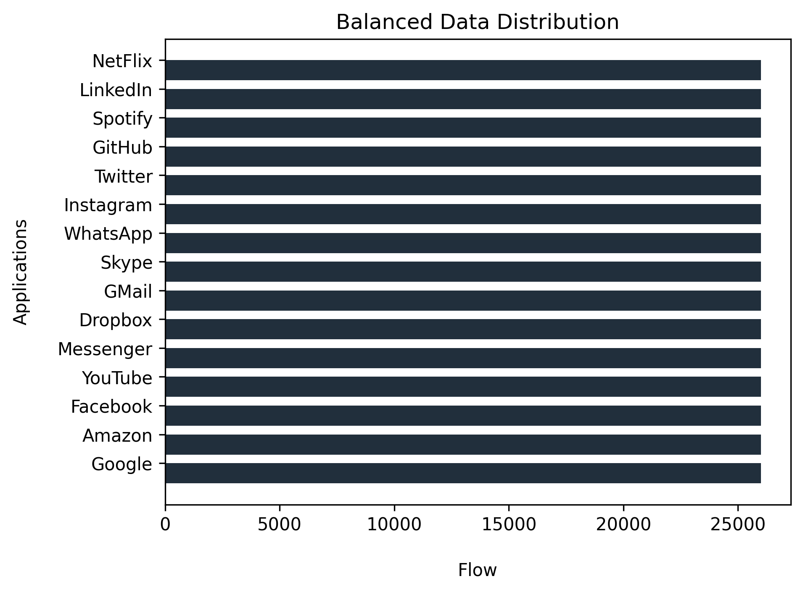
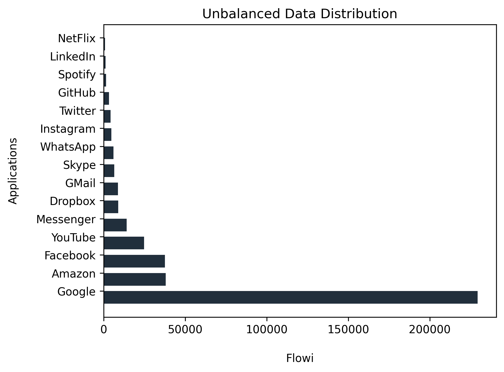

# The Classification with Machine Learning of User ApplicationActivity on Network Traffic
**Collaborators:** Elif  Yener, İrem Aysel İpek, Muhammet Ali Karagüzel

In this study, machine learning techniques have been applied to classify network traffic using network flow features and application tags. The classification techniques are a data mining technique for using an estimate that the data belong to which category.  In this study, the assignment of packets in the network flow traffic of a tagged data set to predetermined application groups is provided by classification algorithms.

The supervised classification algorithms to used in this study are **_k-Nearest Neighbor, Decision Tree, Random Forest, Gaussian Naive Bayes, Support Vector Machine, and Logistic Regression_**. The strengthening algorithm we use is **_XGBoost_**.

Weka software, which is a data mining application, was used to balance the flow sample inequality between the results obtained from the unbalanced data and the applications. Applications with a high ratio have been reduced. The lower ones have synthetically enhanced thanks to the Synthetic Minority Over-sampling(SMOTE) filter.
 

To have a high accuracy value used classification algorithms, selecting proper hyperparameter is important. This process was done with the **_Random Search_** or **_Grid Search_** algorithm, because countless trial and error methods are necessary, to find the best selection of parameters. The _K-Fold Cross Validation_ algorithm was used to understand whether the high performance on the model provided by the hyperparameters used in the algorithms is random or not.
